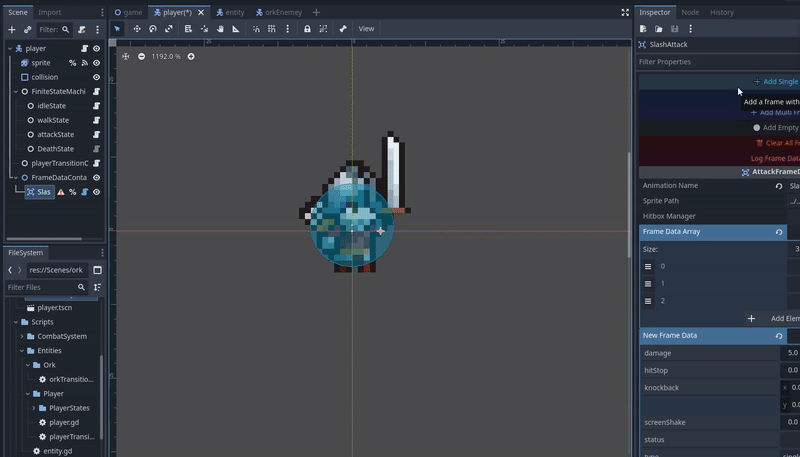

# Framitor
A custom tool/plugin for managing frame-based combat systems for 2D games in Godot 4. 
Create frame-perfect attacks synced to your AnimatedSprite2D animations with visual editor tools.
Heavily inspired by Inbound Shovel on Youtube



## Features

- **Frame-synced hitboxes** - Automatically activate/deactivate hitboxes based on animation frames
- **Visual editor tools** - Add frames with intuitive buttons directly in the inspector
- **Flexible damage system** - Signal-based architecture lets you handle damage your way
- **Customizable frame data** - Set damage, knockback, screen shake, and hitstop per frame
- **Wind-up and recovery frames** - Support for empty frames without active hitboxes
- **Type-safe** - Uses enums for frame types to prevent errors

Perfect for fighting games, beat 'em ups, hack & slash, and action platformers.

## Installation

### Method 1: Godot Asset Library (Recommended)
1. Open Godot's **AssetLib** tab
2. Search for "Combat Frame Data System"
3. Click **Download** and **Install**
4. Enable the plugin in **Project > Project Settings > Plugins**

### Method 2: Manual Installation
1. Download the latest release from [GitHub](https://github.com/0xEvsky/Godot-Framitor)
2. Extract the `addons/framitor/` folder into your project's `addons/` directory
3. Enable the plugin in **Project > Project Settings > Plugins**

## Quick Start

### 1. Set Up the HitboxManager

Create an autoload singleton for the HitboxManager:
```gdscript
# global.gd (Autoload)
extends Node

var hitboxManager: HitboxManager

func _ready():
    hitboxManager = HitboxManager.new()
    add_child(hitboxManager)
```

**Project Settings > Autoload:**
- Path: `res://global.gd`
- Name: `Global`

### 2. Add AttackFrameDataNode to Your Character

## Scene Structure

Create a Node2D container to organize your character's attacks:
```
Player (CharacterBody2D)
├── Sprite (AnimatedSprite2D)
├── FrameDataContainer (Node2D) ← Add this container
│   ├── LightAttack (AttackFrameDataNode) ← One node per attack
│   │   └── Frame0 (CollisionShape2D) ← Created by editor buttons
│   └── HeavyAttack (AttackFrameDataNode)
│       ├── Frame0 (CollisionShape2D)
│       └── Frame1 (CollisionShape2D)
└── CollisionShape2D
```
**Setup Steps:**
1. Create a `Node2D` as a child of your character (e.g., "FrameDataContainer")
2. Add `AttackFrameDataNode` nodes as children of the container
3. Each `AttackFrameDataNode` represents one attack animation
4. Use the editor buttons to add frames - they create `CollisionShape2D` children automatically

>For detailed information about configuring `AttackFrameDataNode`, see the [API Reference](#attackframedatanode).

### 3. Configure in Inspector

Select the `AttackFrameData` node:
- **Animation Name**: The animation name this attack uses (e.g., "attack")
- **Sprite**: Drag your AnimatedSprite2D node here
- **Frame Data Array**: Use the editor buttons to populate

### 4. Use Editor Buttons to Create Frames

Click the buttons in the inspector to add frames:
- **➕ Add Single Frame** - Adds a frame with one hitbox
- **⚪ Add Empty Frame** - Adds wind-up/recovery frame (no hitbox)
- **🗑️ Clear All Frames** - Removes all frame data

Each frame corresponds to one frame of your animation.

### 5. Connect to the Damage Signal

In your enemy/player script:
```gdscript
# enemy.gd
extends CharacterBody2D

var health: float = 100.0

func _ready():
    # Connect to the damage signal
    Global.hitboxManager.hitLanded.connect(_on_hit_received)

func _on_hit_received(target: Node2D, damage: float):
    if target == self:
        health -= damage
        print("Took %s damage! Health: %s" % [damage, health])
        
        if health <= 0:
            queue_free()
```

### 6. Integration with State Machines

If you're using a Finite State Machine (FSM) pattern:
```gdscript
# In your attack state
func enter():
    attack_node.startAttack()
    sprite.play("attack")

func exit():
    attack_node.endAttack()
```

**Simple approach (no FSM):**
```gdscript
# In your input handler
func attack():
    attack_node.startAttack()
    sprite.play("attack")
    await sprite.animation_finished
    attack_node.endAttack()
```

**Key Points:**
- Call `startAttack()` when the attack begins
- Call `endAttack()` when the attack finishes
- The system handles hitbox activation automatically based on animation frames

## API Reference

### AttackFrameDataNode

#### Properties
```gdscript
@export var animationName: String
```
The animation name this attack syncs with.
```gdscript
@export var sprite: AnimatedSprite2D
```
Reference to the character's AnimatedSprite2D (drag & drop in inspector).
```gdscript
@export var frameDataArray: Array[Dictionary]
```
Frame-by-frame attack data. Use editor buttons to populate.

#### Methods
```gdscript
func startAttack() -> void
```
Call when the attack animation begins. Enables hitbox detection.
```gdscript
func endAttack() -> void
```
Call when the attack animation ends. Disables all hitboxes.

#### Frame Data Structure

Each frame in `frameDataArray` contains:
```gdscript
{
    "type": FrameType.SINGLE,     # EMPTY, SINGLE, or MULTI
    "damage": 10.0,                # Damage amount
    "knockback": Vector2(100, -50), # Knockback force
    "screenShake": 0.2,            # Screen shake intensity
    "hitStop": 0.1,                # Hitstop duration
    "status": {},                  # Custom status effects
    "hitboxIndex": 0               # Which CollisionShape2D to use
}
```

>**Roadmap Note:** The frame data structure includes fields for `knockback`, `screenShake`, `hitStop`, and `status` effects, but these are not yet automatically processed by the system. Currently, only `damage` is handled via the `hitLanded` signal. Future updates will add built-in support for these effects. In the meantime, you can access these values through the HitboxManager's properties and implement them yourself.

---

### HitboxManager

#### Signals
```gdscript
signal hitLanded(target: Node2D, damage: float)
```
Emitted when a hitbox collides with a body. Connect to this in your character scripts.

**Parameters:**
- `target`: The Node2D that was hit
- `damage`: Damage value from the current frame data

#### Methods
```gdscript
func loadFrameData(frameData: Dictionary, attackNode: AttackFrameDataNode) -> void
```
Loads frame data and checks for collisions. Called automatically by AttackFrameDataNode.

## Frame Types
```gdscript
enum FrameType {
    EMPTY,   # No hitbox (wind-up/recovery)
    SINGLE,  # One active hitbox
    MULTI    # Multiple hitboxes (not yet implemented)
}
```

## Troubleshooting

### "animationName must be set" error
Make sure you've set the **Animation Name** field in the inspector to match your AnimatedSprite2D animation.

### "sprite must be set" error
Drag your AnimatedSprite2D node into the **Sprite** field in the inspector.


## Roadmap

- [ ] Multi-hitbox frames support
- [ ] Visual hitbox editor in viewport
- [ ] Animation preview with hitbox visualization
- [ ] Preset frame data templates
- [ ] Hit particles/effects system

## Contributing

Contributions are welcome! Please:
1. Fork the repository
2. Create a feature branch
3. Submit a pull request

## License

MIT License - See [LICENSE](LICENSE) for details

## Credits
Created by [0xEvsky](https://github.com/0xEvsky)  
Heavily Inspired by [Inbound Shovel](https://www.youtube.com/@InboundShovel) on Youtube

## Support

- **Documentation**: [docs](docs)
- **Issues**: [GitHub Issues](https://github.com/0xEvsky/Godot-Framitor/issues)

---

Please consider starring if you found it helpful <3!